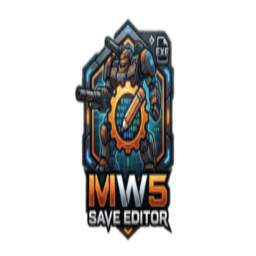
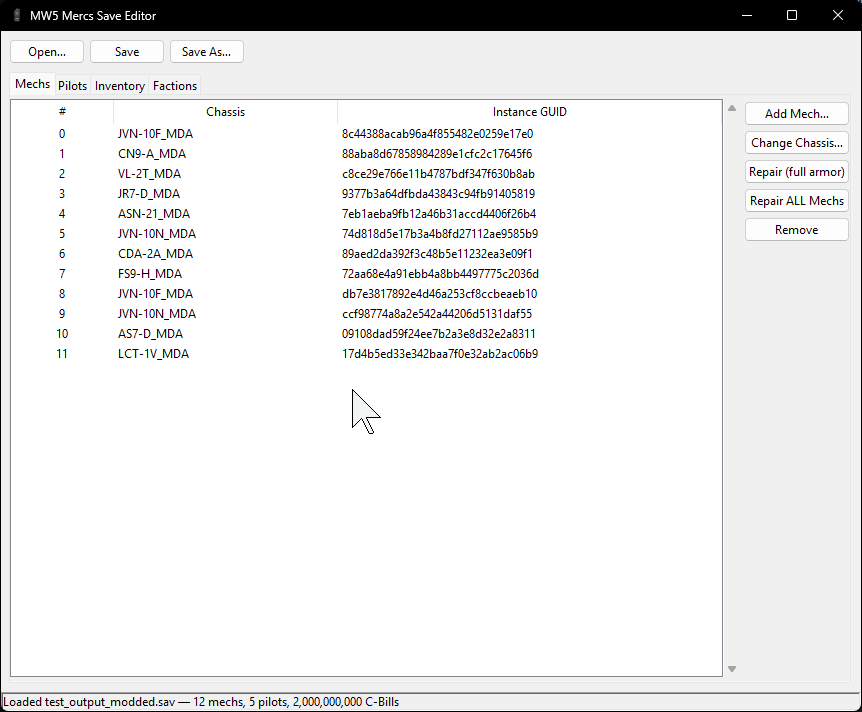
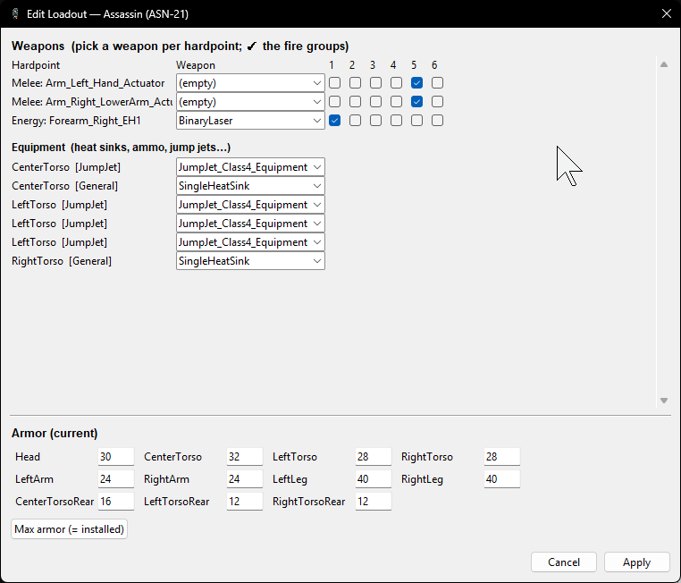
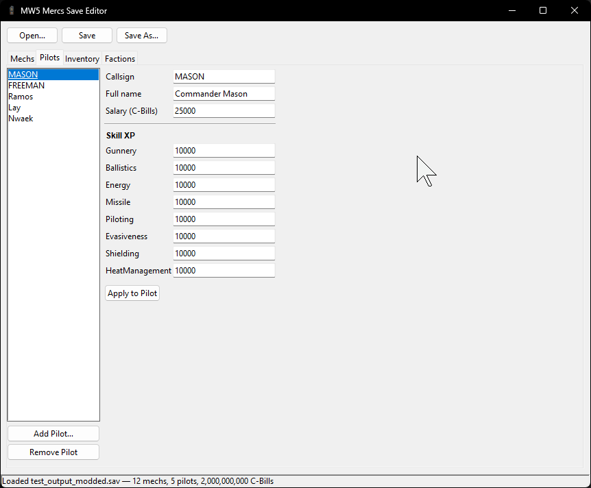
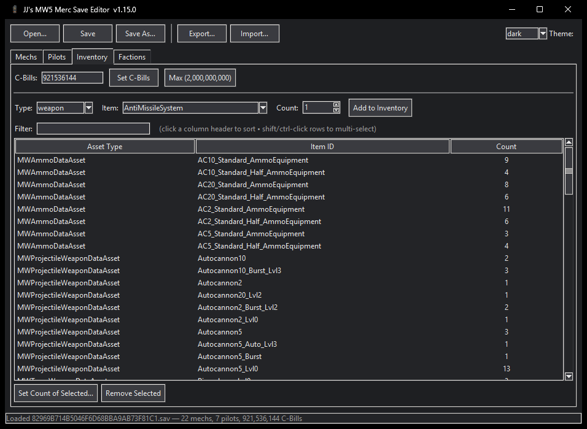
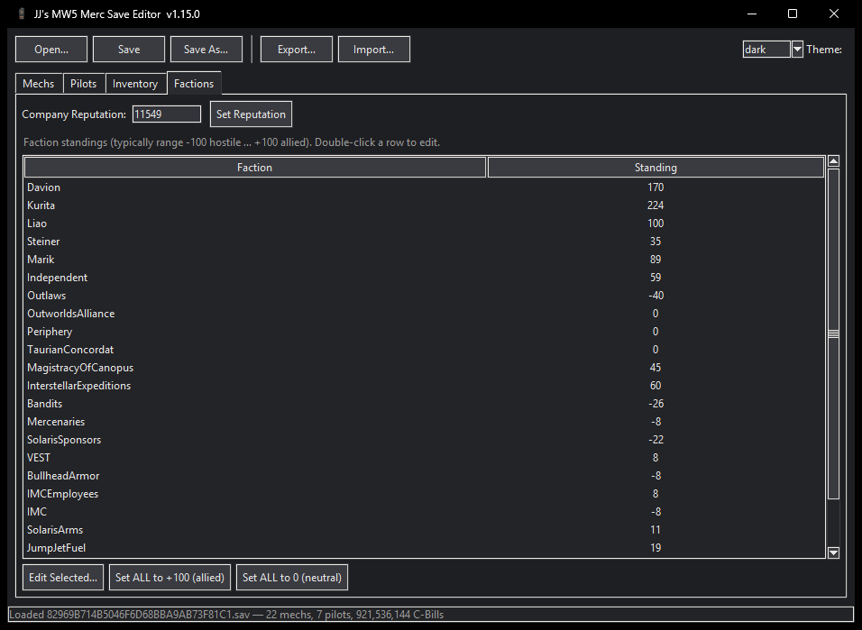
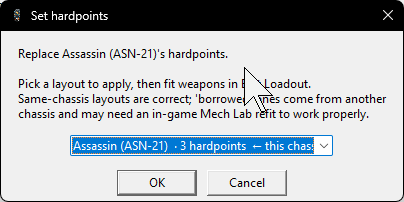

<p align="center">
  
</p>

<h1 align="center">JJ's MW5 Merc Save Editor</h1>

<p align="center">
  A free save editor for <b>MechWarrior 5: Mercenaries</b> — edit your mechs,
  pilots, inventory, C-Bills and faction standings in a simple Windows app.
</p>

---

## ⬇️ Download

**[➡️ Download the latest version from the Releases page](../../releases/latest)**

Grab `MW5SaveEditor.exe`, double-click it, and you're in. No install, no Python,
nothing else needed.

> 💡 The first launch takes a few seconds (the app unpacks itself). That's normal.

---

## ✨ What you can edit

- **Mechs** — add any chassis (full vanilla + DLC roster), swap a mech's chassis,
  repair armor (single or *all* mechs at once), or remove mechs.
- **Pilots** — edit callsign, name, salary, and all skill XP; add or remove
  **traits**; add brand-new pilots or remove them.
- **Inventory** — add weapons, equipment, and ammo (with searchable lists), set
  counts, or remove items.
- **C-Bills** — set your money to anything (one-click max).
- **Factions** — edit your standing with all 17 factions and your company
  reputation.

---

## 📸 Screenshots

| Mechs | Loadout editor (weapons · equipment · armor) |
|:---:|:---:|
|  |  |
| **Pilots** | **Inventory** |
|  |  |
| **Factions** | **Set Hardpoints** |
|  |  |

---

## 🕹️ How to use

1. **Back up your save first** (seriously — see below).
2. Open `MW5SaveEditor.exe`.
3. Click **Open…** — it points straight at your MW5 saves folder
   (`%LOCALAPPDATA%\MW5Mercs\Saved\SaveGames`).
4. Edit what you like across the **Mechs / Pilots / Inventory / Factions** tabs.
5. Click **Save**, then load the save in-game.

---

## ⚠️ Please read — back up your saves

This tool edits your save files directly. **Always keep a backup** before editing.

- The editor automatically writes a `.bak` copy the first time it saves over a
  file — but you should keep your own copy too.
- Use at your own risk. Save editing is not supported by the game's developers.

---

## 🛡️ "Windows protected your PC" / antivirus / "malware" flag

Because this is a small indie tool that isn't code-signed (signing costs money),
Windows SmartScreen or your antivirus may warn you the first time you run it,
especially right after a new release. This is normal for tools like this and does
**not** mean there's anything wrong. To run it: click **More info**, then **Run anyway**.

**About virus detections like `Trojan:Script/Wacatac.B!ml` (or `W32.Malware.*`): these are
false positives.** The app is compiled with [Nuitka](https://nuitka.net/) into a native
binary, and every release is built in the open by GitHub Actions, so you can see exactly
what goes into it. A detection ending in `!ml` comes from a scanner's machine-learning
heuristic rather than a real signature match. New, unsigned, low-prevalence executables
set these heuristics off until they build up reputation, and `Wacatac.B!ml` is one of the
most commonly reported false positives against legitimate indie software.

To be sure and carry on:

- **Verify your download.** A genuine copy matches the SHA-256 hashes published for that
  release. For **v1.11.2**:
  - zip: `21E283FC6B0D4FC02E073EEFF358A9C54FB1EB2140147CE6E0EEE231F115D1FF`
  - `MW5SaveEditor.exe`: `214D469647636BC74749DCDEB57C6912D296C7CDE6325B7D96D5FD73375D96EE`

  If your hash matches, it's the real release. If it doesn't, delete it and re-download
  from the official [Releases page](../../releases/latest) or Nexus, not a mirror.
- **Second-opinion scan.** Upload the file to [VirusTotal](https://www.virustotal.com/).
  A few heuristic engines flagging it while the rest come back clean is what a false
  positive looks like.
- **Allow it** in Windows Security under Virus & threat protection → Protection history →
  Allow / Restore, or add a folder exclusion.

> Maintainer note: report flagged builds to the
> [Microsoft false-positive portal](https://www.microsoft.com/en-us/wdsi/filesubmission) so
> Defender pushes a cloud correction for all users. The hashes above are per-release, so
> refresh them each version. Proper code signing is the durable fix; [SignPath](https://signpath.io/)
> offers free certificates for open-source projects.

---

## ❓ FAQ

**Does it work with all the DLC?**
Yes — the mech and item lists include vanilla + DLC content. The game safely
ignores anything from a DLC you don't own.

**What's the difference between an "exact" and "approximate" added mech?**
If you already own a mech of that chassis, Add Mech makes a perfect duplicate.
If you don't, a mech's true layout (engine, hardpoints, max armor) lives in the
*game's* files, not the save — so it can't be built perfectly. In that case you
get an **approximate** clone with its weapons stripped: open it in the Mech Lab
and refit it, and everything (including weapon groups) works correctly.

**My added mech's weapon groups won't stick / weapons won't fire.**
Two things: (1) In the Mech Lab's **Weapon Groups** tab, make sure each weapon is
assigned to a group (1–6) — unassigned weapons don't fire. (2) For an
*approximate* added mech, **strip and refit it** first; it ships with no weapons
so you start from a clean, correct loadout.

**Will this corrupt my save?**
It's built around a lossless save format — saving without making changes produces
a byte-for-byte identical file. Still: **keep a backup.**

---

## 🛠️ Build / run from source

The editor is pure Python + Tkinter (Tkinter ships with Python on Windows), so
there are no dependencies to run it from source:

```bash
python editor/gui.py
```

To rebuild the standalone EXE, install [Nuitka](https://nuitka.net/) (it will offer to
download a C compiler on first run):

```bash
pip install nuitka
python -m nuitka --standalone --enable-plugin=tk-inter \
  --windows-console-mode=disable \
  --windows-icon-from-ico=editor/app_icon.ico \
  --include-data-files=editor/app_icon.ico=app_icon.ico \
  --include-data-files=editor/app_icon.png=app_icon.png \
  --assume-yes-for-downloads \
  --output-dir=build_out --output-filename=MW5SaveEditor.exe \
  editor/gui.py
```

This produces a `MW5SaveEditor` folder; run `MW5SaveEditor.exe` inside it. The released
builds are produced exactly this way by `.github/workflows/release.yml`. The project moved
from PyInstaller to Nuitka because PyInstaller's self-extracting launcher tripped more
antivirus false positives.

### Project layout

| Path | What it is |
|---|---|
| `editor/ue_property.py` | Generic, lossless Unreal Engine tagged-property reader/writer |
| `editor/savefile.py` | High-level save API (`SaveFile`, `Mech`, `Pilot`, inventory, factions) |
| `editor/gui.py` | The Tkinter GUI |
| `editor/mech_catalog.py` / `item_catalog.py` | Chassis + item asset-name catalogs |
| `editor/inject_mech.py` | Standalone CLI proof-of-concept for adding a mech |
| `editor/test_roundtrip.py` | Round-trip validation harness |
| `tools/diff_saves.py` | Binary diff helper used while reverse-engineering |
| `notes/format_notes.md` | Reverse-engineered save format notes (the two big gotchas live here) |

## 🤝 Contributing

PRs and issues welcome! Good first contributions:

- **More mech / weapon / equipment asset names** — the catalogs are seeded from
  real save data + community lists but aren't exhaustive.
- **A "Mech Cold Storage" tab** (stored/mothballed mechs).
- **Per-chassis max armor values** so added/swapped mechs spawn fully armored
  instead of needing an in-game refit.

The golden rule of this codebase: **a no-op save must stay byte-for-byte
identical to the original.** `editor/test_roundtrip.py` and the model sweep in
`notes/format_notes.md` are how that's validated — please keep it lossless.

## 🙏 Acknowledgments

- **FiendishDrWu** — contributed the game's full asset list and clean-room save-format
  notes (cold storage, campaign date, DLC tables) in [issue #2](../../issues/2), which
  drove the expanded catalogs and the Add Mech cleanup.
- **DallasSukerkin** — reported the Add Mech and AMS issues fixed in v1.11.2.
- Everyone on Nexus and GitHub who has filed reports and suggestions.

## 📝 Changelog

**v1.11.2**
- **Much bigger item lists** — the weapon/equipment/ammo catalogs now cover the
  game's full asset list (weapons go from ~70 to **712**, every tier variant),
  so far more gear is selectable in the Inventory and Loadout pickers without
  having to encounter it first. (Asset data contributed by **FiendishDrWu** in
  issue #2 — thank you!)
- **Fix: Add Mech** now only lists chassis the game actually has. The picker used
  to include 74 tabletop-only variants that aren't in MW5; adding one wrote a mech
  the game silently dropped on load (it "didn't appear"). Those are removed, and a
  mis-cased Kintaro (KTO-19b) is fixed. A mech that still won't appear is from a
  DLC you don't own. (Reported by **DallasSukerkin**.)
- **Fix: AMS** (Anti-Missile System) now shows up in the item lists — it's a
  weapon-type asset, so look for it under weapons. (Reported by **DallasSukerkin**.)
- **Fix:** mechs listed in a **market** no longer appear as your **owned** mechs.
  They share the same internal list as your bay but are now correctly filtered
  out by loadout type (cold-storage mechs too; a proper Cold Storage view is on
  the roadmap).

**v1.11.0**
- **Pilot traits** are now editable! The Pilots tab has a **Traits** panel — add a
  trait from a dropdown of every trait your save has encountered (or type an asset
  name), or remove one. No more save-scumming to roll the traits you want.
- **Mech traits (experimental).** The **Edit Loadout** dialog can add/remove
  Cantina-style mech quirks (e.g. *Faster Cooling*). This is best-effort and
  **untested in-game** — it's clearly labelled experimental in the app, so back up
  your save before relying on it.

**v1.10.0**
- Inventory quality-of-life: **filter/search box**, **click column headers to
  sort**, **multi-select rows** (shift/ctrl-click) to set count or remove in
  bulk, and **double-click an item** to set its count.

**v1.9.0**
- **Export / Import** — transfer mechs, pilots, inventory, C-Bills and faction
  standings *between saves*. Use **Export…** to write a portable `.mw5export`
  file from one save, then **Import…** to add it all into another (e.g. moving a
  career-mode lineup into a fresh campaign). Imported mechs/pilots get fresh IDs
  so they coexist with what's already there.

**v1.8.0**
- **Rare / DLC weapons & gear** now appear in the dropdowns. When a save loads,
  the editor harvests every weapon/equipment/ammo your save references (from
  markets, missions, enemy mechs, your own gear) and adds them to the Inventory
  and Loadout pickers — so anything you've encountered (Clan ER PPCs, pulse
  lasers, chem lasers, Inferno/Hotloaded ammo, etc.) is selectable, with
  guaranteed-valid names.

**v1.7.0**
- **Pilot skill caps** are now editable! Each skill in the Pilots tab has a
  **Cap (1–10)** field next to its XP, plus a **Max caps (10)** button — set a
  pilot to full potential, then train them up in-game. (Gunnery/Piloting don't
  use the cap system, so those fields are disabled.)

**v1.6.0**
- Builds and releases are now **automated via GitHub Actions** — a version tag
  compiles the Nuitka EXE and publishes it to the GitHub release (and Nexus).
  No functional changes from v1.5.0.

**v1.5.0**
- Now built with **Nuitka** (compiled to a native binary) instead of PyInstaller.
  Same app, but it no longer trips antivirus/"malware" false positives the way
  the PyInstaller build did. (v1.4.0 remains available as the PyInstaller build.)

**v1.4.0**
- **Edit Loadout** now also edits **equipment** — heat sinks, **ammo**, jump
  jets, MASC — per slot, alongside weapons, fire groups, and armor. The options
  are filtered to each slot's type (e.g. ammo/heat sinks go in general slots,
  jump jets in jump-jet slots).

**v1.3.0**
- New **Set Hardpoints…** button: apply a real hardpoint layout to a mech, then
  fit weapons in Edit Loadout. Layouts are harvested from your save (owned mechs,
  market, mission records) — a same-chassis layout is exact; others are
  "borrowed".
- **Add Mech** now uses a chassis's *real* hardpoint layout automatically when
  your save has one on record (e.g. a mech you've seen in a mission), so added
  mechs come out with correct, ready-to-fit hardpoints.

> ℹ️ A chassis's true hardpoints live in the game's files, not the save, so the
> editor can only show/apply layouts it has actually seen. To get a chassis's
> real hardpoints when none exist in your save, fit that mech once in the in-game
> Mech Lab and save — the editor will then show them all.

**v1.2.0**
- You can now build a loadout on a mech that has **no hardpoints** (an
  approximate added mech). Hit **Edit Loadout…** on an empty mech and pick a mech
  to copy a hardpoint layout from — then fit weapons and set groups as usual.
- Approximate added mechs now keep their (emptied) hardpoints instead of being
  fully stripped, so they're editable right away.

**v1.1.0**
- **Mech loadout editor!** Select a mech → **Edit Loadout…** to:
  - Swap, remove, or fill weapons per hardpoint (the list is filtered to each
    slot's class — energy/ballistic/missile/melee — so you can't put an
    autocannon in a laser slot).
  - Set each weapon's **fire group** (1–6) directly — no Mech Lab needed.
  - Edit **armor** per location, with a one-click "Max armor" button.

**v1.0.2**
- **Smarter Add Mech.** If you already own a mech of the chosen chassis, it now
  adds an **exact, fully-working duplicate** (weapons + weapon groups intact).
  For a chassis you don't own, it adds an **approximate** clone with its weapons
  stripped — so it no longer carries stale weapon groups (which caused added
  mechs' fire groups to reset to 1). Refit it in the Mech Lab and groups stick.

**v1.0.1**
- Mech list and the Add-Mech picker now show **friendly names** (e.g. *Javelin
  (JVN-10F)*) and **hero nicknames** (*Atlas "Boar's Head"*, *Centurion
  "Yen-Lo-Wang"*, …) instead of raw asset codes.
- Version now shown in the window title.

**v1.0.0**
- Initial release: Mechs, Pilots, Inventory, C-Bills, and Faction Standings.

## 📄 License

[MIT](LICENSE) — do whatever you like, just keep the copyright notice.

---

<p align="center"><i>Not affiliated with Piranha Games or Microsoft. MechWarrior is a registered trademark of its respective owners.</i></p>
